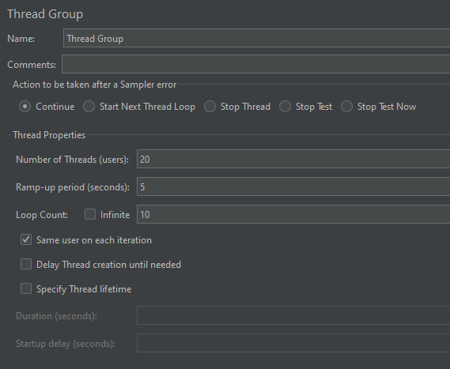
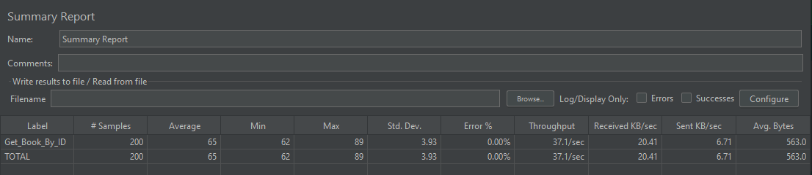
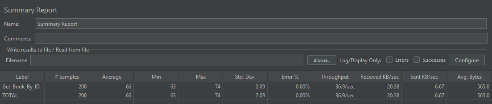

# Library API
## Individuell labb 1K4 - REST API - Jonathan Isaksson

## Funktionalitet

### Grundfunktioner
- Hantering av **Books**
- Hantering av **Authors**
- Hantering av **Loans**
- API-versionering för böcker:
  - `v1`
  - `v2`

### Arkitektur
- Controller → Service → Repository
- DTO används i request/response
- Entities exponeras inte direkt
- Global exception handling
- Standardiserade felsvar

### Säkerhet
- Spring Security skyddar alla `/api/**`-endpoints
- HTTP Basic Authentication används för inloggning
- Strikt CORS-policy
- Input validation på inkommande DTO:er

### Optimering
- Redis-cache för `GET /api/v1/books/{id}`
- Pagination för list-endpoints
- Rate limiting per IP med Bucket4j

### Hemlighetshantering
- Känslig konfiguration har flyttats från `application.properties` till Spring Vault

### Testning
- Integrationstester
- Concurrency-test för lån
- Benchmarking med JMeter

---

## Alla Tekniker

- Java
- Spring Boot
- Spring Web
- Spring Data JPA
- Spring Security
- H2 Database
- Redis
- Spring Cache
- Spring Vault
- Bucket4j
- Swagger / OpenAPI
- JMeter
- Docker Desktop
- Maven

---

## API-endpoints

### Books
- `POST /api/v1/books`
- `GET /api/v1/books`
- `GET /api/v1/books/{id}`
- `GET /api/v2/books`

### Authors
- `POST /api/v1/authors`
- `GET /api/v1/authors/{id}`
- `GET /api/v1/authors/{id}/books`

### Loans
- `POST /api/v1/loans`
- `GET /api/v1/loans`

> Alla `/api/**`-endpoints kräver autentisering.

---

## Pagination
List-endpoints använder pagination för att undvika att för stora datamängder skickas tillbaka i ett svar.

Exempel på query-parametrar:
- `page`
- `size`
- `sort`

Exempel:
```http
GET /api/v1/books?page=0&size=10&sort=id
```

## Swagger och H2

När applikationen körs lokalt kan följande användas:

- Swagger UI: `http://localhost:8080/swagger-ui.html`
- H2 Console: `http://localhost:8080/h2-console`

## Startdata

Projektet använder data.sql för att lägga in startdata i databasen vid uppstart.
Detta är för att underlätta testning så att man inte behöver lägga till en ny bok varje gång vid uppstart.

Just nu finns det bara en bok:

- Shindou Masaoki(Author) med id 1
- Ruri Dragon(Book) med id 1

# Kom Igång Lokalt
### Program Krav
- Docker Desktop
- Maven
- Java (v8 eller senare)

### 1. Starta Redis
Skriv i terminalen
```Bash
docker run --name some-redis -p 6379:6379 -d redis
```
Om containern redan finns
```Bash
docker start some-redis
```

### 2. Starta Vault
Samma här i terminalen skriv
```Bash
docker run --cap-add=IPC_LOCK -e VAULT_DEV_ROOT_TOKEN_ID=root -e VAULT_DEV_LISTEN_ADDRESS=0.0.0.0:8200 -p 8200:8200 --name some-vault -d hashicorp/vault:latest server -dev
```
Lägg in användarnamn(Username) och lösenord(Password) med:
```Bash
docker exec -it some-vault sh
```
Sedan inne i containern:
```Bash
export VAULT_ADDR=http://127.0.0.1:8200
export VAULT_TOKEN=root

vault kv put secret/application app.security.username=libraryuser app.security.password=librarypass
```
### 3. Starta Programmet
Kör projektet via IntelliJ eller Maven.

### 4. Testa Projektet
Använd Swagger UI och logga in med de användarnamn och lösenord som du lagrade i Vault:en.

# Prestandatest
Använde **JMeter** för att lätt göra benchmark tester.

Detta var uppsättningen för benchmark-testerna:



Första testet var utan Caching och resultatet såg ut såhär:



Andra testet var med Caching och resultatet såg ut såhär:



Som ni kan se var det ingen större skillnad här. Om vi räknar på resultatet får vi:

`
((65 - 66) / 65) * 100 = -1.54 %
`

Det innebär att caching-testet i just denna lokala testmiljö blev cirka 1.54 % tyngre än testet utan caching. Detta kan bero på att anropet inte var särskilt krävande och att H2-databasen redan är väldigt snabb i minnet. Däremot visar testet att lösningen fungerar och är möjlig att verifiera praktiskt.
